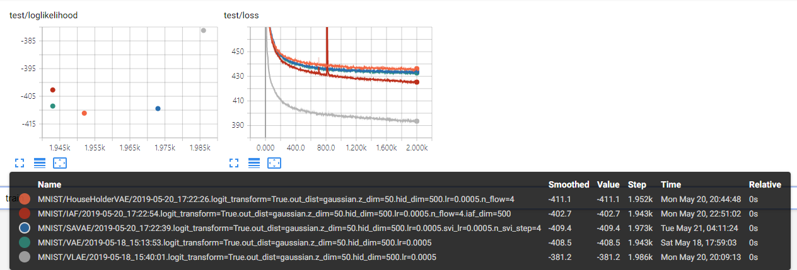

# VLAE
Pytorch implementation for paper **Variational Laplace Autoencoders** in ICML 2019.

## Prerequisite
This code assumes GPU computation.
- Pytorch 1.0 
- Tensorflow 1.13 (for tensorboard utility)

Install additional required packages
```
pip install -r requirements.txt
```

Make directories for datasets and model checkpoints
```
mkdir checkpoints
mkdir datasets
```

## Running Experiments
To run an experiment
```
python run.py --dataset=MNIST --output_dist=gaussian --model=VLAE --n_epochs=2000 --hidden_dim=500 --z_dim=50 --n_update=4
```
`run.py` will automatically download the dataset at the first run and train the model for `n_epochs`. After the training is finished, it will evaluate the log-likelihood using the best checkpoint using importance sampling (5000 samples by default). 

This repo also includes our implementations of [VAE](https://arxiv.org/abs/1312.6114), [SA-VAE](https://arxiv.org/abs/1802.02550), [HF](https://arxiv.org/abs/1611.09630), [IAF](https://arxiv.org/abs/1606.04934) models which we used as baselines for our experiments. 
Type `python run.py --help` to see help messages on the arguments.

On the other hand, you can manually evaluate a checkpoint (note that you will have to use the same model setting arguments to corretly load the model)
```
python eval.py --dataset=MNIST --output_dist=gaussian --model=VLAE --hidden_dim=500 z_dim=50 --n_update=4 --checkpoint=<path_to_your_checkpoint>
```

## Tensorboard 
Basic Tensorboard logging functionality is implemented. It includes loss curves and image sample visualizations. The tensorboard event file is saved at the checkpoint directory of the model. 
To launch a tensorboard, run:
```
tensorboard --logdir=<path_to_your_checkpoint_direcoty
```

## Notes
- We have slightly changed the implementation for data scale normalization, so the scale of the log-likelihood results is bit different to those reported in the paper.
- The data is normalized so that the reconstruction error `torch.sum((x - mu)**2)` will be initially about d (not 1.0) where d is the data dimension (e.g. 784 for MNIST). The appendix of the paper was incorrectly stated on this. 
- [Some](https://arxiv.org/abs/1605.08803) [papers](https://arxiv.org/abs/1705.07057) preprocess data by adding uniform noise to pixel values, then applying a logit transformation on the data in order to prevent the likelihood from exploding and reduce boundary effects. Though we did not use this in the paper, we have implemented it which can be used by adding an argument `logit_transform=True`. We observe similar experimental results to the paper.

## Results
Example run results using `logit_transform=True`.


## Citation
```
@inproceedings{park2019,
  title={Variational Laplace Autoencoders},
  author={Park, Yookoon and Kim, Chris Dongjoo and Kim, Gunhee},
  booktitle={International Conference on Machine Learning},
  year={2019}
}
```
